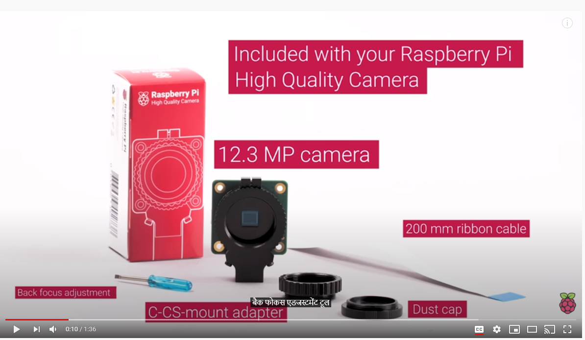
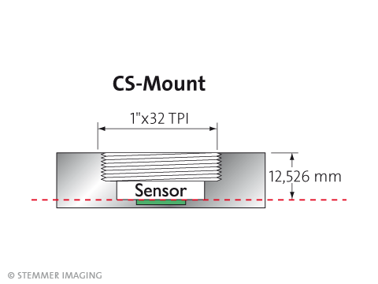
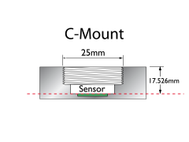
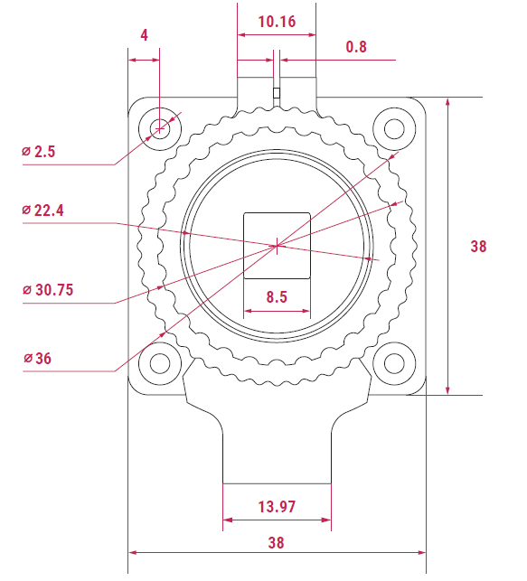

# NeoGaze

neogaze	B8:27:EB:4D:50:D0	192.168.0.54/24	21.72	WI-FI 2.4G VM4826469

pi/raspbery

https://www.raspberrypi.org/documentation/raspbian/updating.md

sudo apt update

sudo apt full-upgrade

https://elinux.org/RPi-Cam-Web-Interface

sudo apt-get update
sudo apt-get dist-upgrade
sudo apt-get install git

git clone https://github.com/silvanmelchior/RPi_Cam_Web_Interface.git
cd RPi_Cam_Web_Interface

./install.sh

The scripts are

install.sh main installation as used in step 4 above
update.sh check for updates and then run main installation
start.sh starts the software. If already running it restarts.
stop.sh stops the software
remove.sh removes the software
debug.sh is same as start but allows raspimjpeg output to console for debugging

Camera:

https://www.stemmer-imaging.com/en-gb/knowledge-base/lens-mounts/

C-CS mount adapter

Telescope eye-piece 1.25"

The first print is good - however.
It needs the insert into the CS-mount narrowing and lengthening.
Narrower by the width of the threads, and longer by 1 or 2 mm.

The telescope insert can be much longer.

I want to try and add tabs, so I can attached it to the camera board...

To add flanges, I think I might need to print it in two pieces.

Prototyping the flanges now as EyeTubeWithFlanges.

I had to make the eye holes bigger, and that spec sheet is wrong! Either than or I can't count.
It's only 30mm between corner hole center.

I'm also trying to print some spacers too...